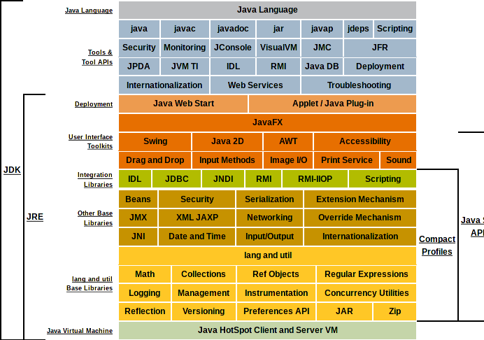
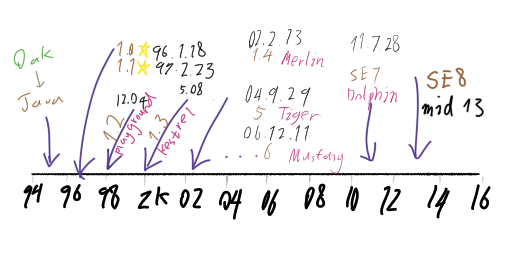

# <ruby><span style="color:brown">Java</span> You-Dont-Know<rt>你不知道的 Java</rt></ruby> [](https://en.wikipedia.org/wiki/Knowledge_base) 

<div align="center">
  
</div>

你不知道的 Java：那些原理不为人知却总是被使用的“黑科技” — 截至 [Java] 语言版本 [1.8]

> 我的语言 Java 今年 23 岁，完美的程序设计材料，完美的 <ruby>OOP<rt>面向对象编程</rt></ruby>语言，但在我手里却是个超辣鸡的[干物] lang。经常看到看不懂的语法、重复的代码、假装会用的泛型，不断 <kbd>Ctrl</kbd> - <kbd>C</kbd>; <kbd>Ctrl</kbd> - <kbd>V</kbd> 抄改别人的代码，可是莫名其妙地无法停下来啊！！！<br>
然而 Java 在这里的一切她生活中的秘密，作为主人的我并不知道，<ruby>推<rt><del>zhōng</del></rt>倒<rt><del>chū</del></rt></ruby>了居住在同一栋楼的天然少女 [C++]，以及无意间来到我家的冷酷少女 [Haskell] 后，我会发现 Java 的真实面目吗？<a href="#notes-intro[0]"><sup>[0]</sup></a>

Java 是什么？Java 是领先全球的[计算机程序设计]技术之一。

Java 是一门[程序设计语言]，它更是一个[软件开发]平台，根据平台的组成部分、主要业务领域区分，Java 技术体系可以被分为 __4__ 个子体系：

[计算机程序设计]: https://en.wikipedia.org/wiki/Computer_programming
[程序设计语言]: https://en.wikipedia.org/wiki/Programming_language_theory
[软件开发]: https://en.wikipedia.org/wiki/Software_engineering

+ __Java Card__：支持一些小程序（[Applets]）在诸如[智能卡]等 __小内存设备__ 上的平台
+ __Java ME__（Micro Edition，J2ME）：支持 Java 运行在智能手机、<abbr title="Personal Digital Assistant">PDA</abbr> 等设备上的技术，对 JavaSE 的 API __有所精简__，并且加入了针对嵌入式通讯设备的 API 支持
+ __Java SE__（Standard Edition，J2SE）：支持面向桌面工作站（和个人电脑、平板等）上如桌面窗口应用程序开发的 Java，提供了完整的 Java 核心 API（比如 [Collections 框架]）以及开发使用的辅助框架（比如 [javax.swing], [java.awt]）
+ __Java EE__（Enterprise Edition，J2EE）：支持使用了多层架构的企业级应用程序（比如 [ERP] 和 [CRM]<a href="#notes-intro[1]"><sup>[1]</sup></a>），以开发各类对应用程序健壮性、安全性、可测试性、可部署性、性能、并发支持性和软件工程理论有较强要求的应用程序（比如生产级别的 <abbr title="client/server">C/S</abbr> 架构服务器程序）
<br>著名的 Java EE 技术例如 [Java Bean] (组合<ruby>可序列化<rt><code>@java.io.Serializable</code></rt><abbr title="java.lang.Object">对象</abbr></ruby>, <ruby>实例<rt>instance</rt></ruby>比如 EJB); [Web servlet] 架构; [JNDI] 服务访问接口架构

[ERP]: https://en.wikipedia.org/wiki/Enterprise_resource_planning
[CRM]: https://en.wikipedia.org/wiki/Customer_relationship_management

[Java]: https://www.oracle.com/java/
[1.8]: https://docs.oracle.com/javase/specs/jls/se8/html/index.html
[干物]: https://zh.moegirl.org/%E5%B9%B2%E7%89%A9%E5%A5%B3#

[C++]: https://en.wikipedia.org/wiki/C%2B%2B
[Haskell]: https://www.haskell.org/

[智能卡]: https://en.wikipedia.org/wiki/Smart_card
[Applets]: https://en.wikipedia.org/wiki/Java_applet

[Collections 框架]: https://docs.oracle.com/javase/8/docs/technotes/guides/collections/reference.html
[java.awt]: https://docs.oracle.com/javase/8/docs/api/java/awt/package-summary.html
[javax.swing]: https://docs.oracle.com/javase/8/docs/api/javax/swing/package-summary.html
[Java Bean]: https://en.wikipedia.org/wiki/JavaBeans
[Web servlet]: https://en.wikipedia.org/wiki/Java_servlet
[JNDI]: https://en.wikipedia.org/wiki/Java_Naming_and_Directory_Interface

<div id="intro-javase8-stack" align="center">
  <details open>
  <summary><var>JavaSE 8 <a href="https://docs.oracle.com/javase/8/docs/#content">技术栈</a></var></summary>
  
  </details>
</div>

Java 开发平台提供了以 Java 程序设计语言为核心的 __完整跨平台程序设计开发工具链__，并且，它被广泛地应用于桌面程序、服务器程序、移动终端、大型计算机等场合。

Sun 定义的 Java 技术体系包含以下项目：

<dl>
  <dt>Java 程序设计语言</dt>
    <dd><div id="intro-lang">
      Java 程序设计语言是 Java 开发平台的 <b>灵魂</b>
      <br>Java 是一门 <b>强类型、静态检查、显式类型</b> 的“低糖”语言，它支持<a href="https://en.wikipedia.org/wiki/Programming_paradigm">面向对象编程、面向对象多态、并发编程、事件驱动、反射元编程、泛型编程、Annotation 处理</a>，当然，也包含基本的<a href="https://en.wikipedia.org/wiki/Functional_programming">函数式编程</a>和<a href="https://en.wikipedia.org/wiki/Recursion_(computer_science)">递归</a>支持
      <br>Java 是使用<abbr title="garbage collection">自动内存管理</abbr>的程序设计语言，这意味着，你不需要考虑如何为这门语言的『值』分配内存空间。
      Java 的对象会在需要时被 <code>new</code> 创建，不可能被访问时自动丢弃。
      <br>Java 很大程度上类似 C++，但没有采用 C++ 的<abbr title="指针是计算机科学 PLT 里的一种数据类型概念。1964 年它被计算机科学家 Harold Lawson 首创；C99、Ada95、FreeBasic、C# 等语言都对指针概念的良好支持，用于进行内存单元对象的偏移取值等运算">『指针』</abbr>模型，只支持『<ruby>可空<rt>nullable</rt>』</ruby>引用和提供 <code>native</code> 方法来取代，并且移除了 C++ 里的<abbr title="operator overloading">操作符重载</abbr>和<a href="https://zh.wikipedia.org/wiki/%E7%BB%A7%E6%89%BF_(%E8%AE%A1%E7%AE%97%E6%9C%BA%E7%A7%91%E5%AD%A6)">多继承</a>，用 <code>interface</code> 接口规范定义取代。
      <br>自 <a href="https://www.oracle.com/technetwork/java/javase/archive-139210.html#top">Java 1.5</a> 以来，Java 引入了类型安全的 <code>enum</code>、值类型自动装箱拆箱、基于泛型擦除的泛型检查、不定长参数、foreach (<code>for (VarModifier TypedVarId: Expression)</code>) 等特性，Java 技术进入了新时代。
      <br><br>Sun Microsystems 这么描述 Java:
      <br><blockquote>Java 是个简单、面向对象、分布式、解释性、健壮、安全、与系统平台无关、可移植、高性能、多线程和动态灵活的编程语言</blockquote>
    <div id="intro-java-links">
      <br><a href="https://github.com/antlr/grammars-v4/blob/master/java8/Java8.g4#L877">Java 8 ANTLR Grammar</a>
      <br><a href="https://docs.oracle.com/javase/specs/jls/se8/html/index.html">Java 8 Language Spefification</a>
      <br><a href="https://docs.oracle.com/javase/specs/jvms/se8/html/index.html">Java 8 JVM Spefification</a>
    </div></div></dd>
  <dt>Class 文件格式<sub>（Java 字节码格式）</sub></dt>
    <dd><div id="intro-classfile-links">
      <a href="https://duckduckgo.com/?q=Javaassist&t=ffab&atb=v163-1&ia=web">JavaAssist Java bytecode engineering toolkit</a>
      <br><a href="http://asm.ow2.org/">ObjectWeb ASM bytecode manipulation and analysis framework</a>
      <br><a href="https://github.com/apache/commons-bcel">Apache Commons Bytecode Engineering Library (BCEL)</a>
      <br><a href="https://github.com/cglib/cglib">CGLib</a>
    </div></dd>
  <dt>Java 虚拟机<sub>（在各种实际硬件和操作系统平台上的实现）</sub></dt>
    <dd><p id="intro-jvm">JVM 是一个虚拟机，它是 Java 和众多其他 JVM 语言的运行环境，它允许自己的<ruby>本地<rt>native</rt></ruby>计算机执行 Java 字节码
    <br>知名的 JVM 语言包括 <ul>
      <li>Java (Oracle Java, formerly Sun Java)</li><br>Java 是一种通用编程语言，它的代码基于类，实现面向对象编程（虽然不是纯 OO 语言，因为它包含<ruby>基本类型<rt>primitive types, likely <code>int</code></rt></ruby>），并且设计为使尽可能减少强<a href="https://zh.wikipedia.org/wiki/%E8%80%A6%E5%90%88%E6%80%A7_(%E8%A8%88%E7%AE%97%E6%A9%9F%E7%A7%91%E5%AD%B8)">耦合</a>程序。 它旨在让应用程序开发人员编写一次，在任何地方运行（"<i>WORA</i>"），这意味着编译的 Java 代码可以在所有支持 Java 的平台上运行而无需重新编译。<br>
      <li><a href="https://kotlinlang.org/">Kotlin</a> (JetBrains)</li><br>发展迅速的 JVM 编程语言；其名字源自于俄罗斯<abbr title="Saint Petersburg">圣彼得堡</abbr>的一座小岛<abbr title="Kotlin; Russian: Котлин">科特林</abbr>
      <br>Kotlin 于 2011 年被 <a href="https://en.wikipedia.org/wiki/JetBrains">JetBrains</a> （知名的开发工具公司）谋划并于 2012 年开源其第一个编译工具版本，现在已经有 JVM, JavaScript<sub>(Plain, AMD, UMD, CommonJS)</sub>, Native 等多种目标语言的编译实现
      <br>Kotlin 受 Java, Groovy, Scala, C#, <a href="http://gosu-lang.github.io/">Gosu</a> 等语言<abbr title="受 Gosu 启发的主要是它的简洁语法
Kotlin 的语法从结构上和 Gosu 非常类似，Groovy 的语法和 Gosu 比非常难看
Scala 是主打函数式编程的，但对入门者来说比 Kotlin 更难理解
C# 和 Java 的语法糖程度都比较低">启发</abbr>
      <br>Kotlin 支持可空类型系统、<abbr title="底类型；kotlin.Nothing::class, 类似 java.lang.Void 但是不为空">Bottom Type</abbr>、闭包、类型投影等 Java 严重缺失的概念，语言本身比 Java 更富语法糖化，同样的程序甚至完全相同的控制结构算法，用 Kotlin 表达会更简短好看；Kotlin 简洁、安全、完全支持与 Java API 互操作、对语言工具（比如 <abbr title="集成开发环境, Integrated development environment">IDE</abbr>）友好
      <br>Kotlin 是一个从来不缺特性的语言 — <abbr title="kotlinx.coroutines">协程</abbr>、类型推导、<b>完全</b>面向对象（<code>class</code>, <code>object</code>, <code>companion object</code>）、扩展函数、<code>typealias</code>、面向对象 <abbr title="在没有继承关系的两个类之中混入相同的操作接口；Mixin 是提供了方法的实现的类。其他类可以访问 mixin 类的方法而不必成为其子类，它可以视作带实现的 interface、不应该直接被实例化；这种设计模式实现了依赖反转原则。"><ruby>mix-in<rt>混入</rt></ruby></abbr>、first-class 面向对象代理、属性（property）、密封类<sub>(<code>sealed class</code>)</sub>、数据类<sub>(<code>data class</code>)</sub>和数据类解构赋值、注解类<sub>(<code>annotation class</code>)</sub>、<code>internal</code> 访问限制、<code>lateinit var</code> 实例字段属性、闭包<sub>(lambda)</sub>、高阶函数、<ruby>尾递归<rt><code>tailrec</code></rt></ruby>、灵活控制流<sub>(labled chunk)</sub>、<code>if</code> 表达式、<code>when</code> 分支判断、内联（inline）方法和类、<code>vararg</code>、操作符重载、和 <code>Object#equals</code> 等价的 (<code>==</code>) 二元逻辑运算符、<code>infix</code> notation (e.g. <code>to</code>, <code>until</code>)、elvis (<code>?:</code>) 和 null 传导 (<code>?.</code>)、区间和 <code>Pair</code>、多行字符串、强制标识符合法化（<code>val `#_#` = 0x0_0</code>）、软化关键字（soft keywords）、<code>in out</code> 和声明处型变、<code>reified</code> 内联实现真泛型
      <br>Kotlin 的编译器 <a href="https://github.com/JetBrains/kotlin/tree/master/compiler">kompiler</a> 是开放可嵌入的，Gradle、Maven、Ant 和众多 IDE 工具皆可集成 Kotlin Compiler 进行代码生成分析的工作，这使得为 Kotlin 开发语言工具、集成到已有工具平台更为简单
      <br>2017 年，Kotlin 1.0 版本发布以后的第一年，Google I/O 大会上宣布 Kotlin 成为 Android 开发的『官方』语言
      <br>和 Scala 相比，Kotlin 是为工程师设计，更符合实际工程实践需要，语法类似 Java 和 Scala
      <br>目前 Kotlin 已经成为 Android 开发的流行语言，被誉为 Android 平台的 <abbr title="Apple 开发的一门编程语言，可以类比 Mozilla Rust">Swift</abbr>
      <br>虽然是门『新语言』，Kotlin 的学习曲线极其平缓、学习量相当于学习一个新框架，只需要看几十行代码就可以扔掉 Java，开始学着使用 Kotlin 编程了<br>
      <li><a href="http://groovy-lang.org/">Groovy</a> (Apache)</li><p>
      Apache Groovy 是一个可选类型、动态性强的语言，它有着静态类型和静态编译的能力，旨在通过提供简洁、符合习惯、易读、易学语法的方式提高 JVM 开发人员的工作效率。
      <br>它和任何 Java 程序都良好兼容，并且可以在极短的时间里让你的应用拥有强大的功能 — 脚本支持、<abbr title="Domain-Specific Language，领域专属语言，比如专门为纯文本交互游戏开发的语言 、专门为文字处理开发的语言 SED, AWK、为文字游戏设计的 TADS、Graphviz 的 DOT">DSL</abbr> 支持，函数式编程、<ruby>编译期<rt>compile-time</rt></ruby>和<ruby>运行期<rt>run-time</rt></ruby>的<abbr title="metaprogramming，也被称为 inspect（自我审视），程序访问关于自己本身（比如，函数的名字）信息的技术">元编程</abbr>。
      </p>
      <li><a href="https://www.scala-lang.org/">Scala</a></li>
      <li><a href="https://clojure.org/">Clojure</a></li>
      <li><a href="https://github.com/mozilla/rhino">JavaScript (Mozilla Rhino)</a></li>
      <li><a href="https://github.com/JetBrains/jdk8u_nashorn">JavaScript (Oracle Nashorn)</a> <a href="https://hg.openjdk.java.net/jdk8/jdk8/nashorn/">[at OpenJDK]</a></li>
      <li><a href="https://www.jruby.org/">JRuby</a></li>
      <li><a href="https://www.jython.org/">Jython</a></li>
      <li><a href="https://github.com/beanshell/beanshell">BeanShell</a></li>
    </ul>
    </p><div id="intro-jvm-links">
      <a href="https://github.com/imkiva/KiVM">KiVM Java VM (spec version 8 and only Java 8 is supported) implementation in C++</a>
    </div></dd>
  <dt>Java 语言 API <sub>（<code>java.*</code> 标准库）</sub></dt>
  <dt>Java 外部 API <sub>（来自商业机构和开源社区的第三方 Java <abbr title="Class library">类库</abbr>）</sub></dt>
</dl>

<div id="jdk,jre">
<b>我们把 Java 程序设计语言的基础工具、Java 虚拟机、Java API 这三部分统称为 <abbr title="Java Development Kit">JDK</abbr>，它是进行 Java 软件开发的最小支持环境

我们也把 Java 虚拟机、JavaSE API <sub>(所有 Java API 的子集)</sub> 这两部分统称为 <abbr title="Java Runtime Environment">JRE</abbr>，它是支持 Java 程序运行的基础环境</b>
</div>

<div id="intro-java-version-history" align="center">
  <details open>
  <summary><var>Java 版本历史</var> <a href="https://en.wikipedia.org/wiki/Java_version_history">详情</a></summary>
  
  </details>
</div>

时至今日，Java 技术已经吸引了 __900 多万__ 名软件开发者，使用 Java 技术的设备多达 __几十亿__ 台，包含众多智能卡、机顶盒、导航系统、游戏机和其他设备。<a href="#notes-intro[2]"><sup>[2]</sup></a>

由 Google 主导开发而领先世界且与 Apple 的 iOS 二分天下的移动操作系统平台，Android，[Android 使用的软件开发技术](https://en.wikipedia.org/wiki/Android_(operating_system)#Software_stack)，就是 Java 技术的一个衍生品。

__1991 年__，由 James Gosling 领导的 "_Green_ Project" 项目启动，此计划的目的是开发一种能够在多种消费电子产品（比如游戏机、机顶盒、个人电脑等）上面运行的程序运行时和软件平台架构。这个架构就是 Java 的前身：Oak（橡树），它尝试扩展 C++，和早期的 Java 大同小异<a href="#notes-intro[3]"><sup>[3]</sup></a>

即便其前身 [Oak] 在市场上并不算成功，Java 的诞生正好赶上了那个无论软件需求量还是工程量都暴涨的网络时代 — 这个时代只接受同类软件中 __第一个__ 弄出来的！

[Oak]: https://en.wikipedia.org/wiki/Oak_(programming_language)

自从 1995 年的 Oak to Java，Java 在 _SunWorld_ 大会上发布第一个版本 1.0 以来，Java 因为其强大的通用性、安全性、稳定性、可移植性、开发效率闻名于世。

Java 的领导者 [James Gosling 博士]从一开始就敏锐地注意到了其他开发平台不安全、时常出现严重的资源内存泄漏、缓冲区溢出、悬垂指针、并发数据竞争，处理复杂繁琐，开发效率低下、必须给不同硬件平台发布不同类型的软件包的问题<a href="#notes-intro[4]"><sup>[4]</sup></a>，Java <abbr title="Java 1.0 发布的时候在 SunWorld 大会上">及时地提出了</abbr> __"Write Once, Run Anywhere"__ 这个口号。极高的开发效率和依此而生的极短开发时间，使 Java 成为网络时代的理想计算平台，从个人智能手机终端到网络服务器，Java 扮演着游戏主持者的角色，赋予了计算以新的复杂性可能。

<div id="intro-java-96">
<b>1996 年 1 月 23 日</b>，JDK 1.0 发布，Java 终于有了第一个正式版本的运行环境

JDK 1.0 提供了一个纯字节码解释器版本的实现 — _Sun Classic VM_

JDK 1.0 时期的 Java 技术包括 JVM、Applet、AWT 等

<b>同年 4 月</b>，10 个操作系统供应商声明将在其产品中嵌入 Java 技术

<b>同年 9 月</b>，已经有 8.3 万网页使用了 Java 技术制作。

<b>同年 5 月底</b>，Sun 公司于美国<abbr title="San Francisco">旧金山</abbr>举行了首届 JavaOne 大会，从此 JavaOne 大会成为世界 Java 开发者一年一度的技术盛会

Java 1.1 发布和 <a href="https://www.haskell.org/definition/">Haskell</a> <abbr title="Haskell 1.4">97</abbr> 正好是同一年
</div>

<br><sub>以上内容部分信息来自[《深入理解 Java 虚拟机》第二版]，可以在豆瓣试读
<br><a href="https://book.douban.com/people/RednaxelaFX/annotation/24722612/)">RednaxelaFX对《深入理解Java虚拟机（第2版）》的笔记(6)</a></sub>

[《深入理解 Java 虚拟机》第二版]: https://book.douban.com/subject/24722612/

[James Gosling 博士]: https://en.wikipedia.org/wiki/James_Gosling

<div id="notes-intro"><small>
  <p id="notes-intro[0]"><sup>[0]</sup>详见 B 站<a href="https://www.bilibili.com/bangumi/media/md2580">《干物妹！小埋》</a><del>《干雾妹小霾》</del></p>
  <p id="notes-intro[1]"><sup>[1]</sup><abbr title="Enterprise resource planning">ERP</abbr>, 企业资源管理<br><abbr title="Customer relationship management">CRM</abbr>, 客户资源管理</p>
  <p id="notes-intro[2]"><sup>[2]</sup>信息来自 <a href="https://www.java.com/zh_CN/about/">java.com/zh_CN/about</a></p>
  <p id="notes-intro[3]"><sup>[3]</sup>Oak 的 primitive number 包括 <code>unsigned</code> 无符号整数<small>（考虑一下它受到了 C++ 启发）</small>；Oak 不存在 <i>private</i> 访问（<code>private</code> 是 package-private）；Oak 早就有 <abbr title="Java 1.5 加入（JSR 201）"><code>enum</code></abbr> 和 <abbr title="Java 1.4 加入（JSR 41）"><code>assert</code></abbr> 了；Oak 的 <a href="https://en.wikipedia.org/wiki/Exception_handling#In_software">exceptions</a> 可以不检查(unchecked)；利用 <code>unprotect</code> 关键字异步异常（比如说系统的 SIGINT，<a href="https://docs.oracle.com/javase/8/docs/api/index.html?java/lang/ThreadDeath.html">ThreadDeath</a>）可以不处理、Oak 支持<a href="https://zh.wikipedia.org/wiki/%E5%A5%91%E7%BA%A6%E5%BC%8F%E8%AE%BE%E8%AE%A1">契约式编程</a>（比如，给子类继承的方法前置逻辑）</p>
  <p id="notes-intro[4]"><sup>[4]</sup>排除增强类型系统安全检查强度和动态检查、运行时异常外；使用<ruby>中间码<rt><a href="https://en.wikipedia.org/wiki/Intermediate_representation">intermediate language</a></rt></ruby>，这也是属于见仁见智的问题，实际上，使用平台无关（全平台兼容）的中间代码作为最终的『二进制』形式而不是直接翻译到机器代码，最开始也给 Java 程序的执行带来了一些问题（虽然现在 Java 的选择也显得越来越符合“时代潮流”了），但是，语言<abbr title="『发布』代码的形式，有时被称为『二进制文件』，一般认为是会被持久化在非易失性 (non-volatile) 存储器 (memory) 上的代码形式">“最终”</abbr>的代码形式只是一个选择是否合适、是否符合定位的问题，不存在优劣之分。</p>
</small></div>

## Contents 内容

+ Java 的泛型
  + Java 的类型、子类型和型变
  + Java 类型相关名词解释
    + Subtyping, Type Compatibility, First-class-citizen, Polymorphism
    + Raw Type, Generic Type, Generic Method <sub>(Parameterized Types)</sub>
    + Type Constructor, Type Parameter <sub><abbr title="programming language theory">(PLT)</abbr></sub>
    + [Type Ereasure](https://en.wikipedia.org/wiki/Type_erasure) <sub>(in Java)</sub>
    + Type Wildcard (`capture<…>` in Java)
  + Java 的<ruby>泛型通配符<rt>Type wildcard</rt></ruby>、<ruby><abbr title="producer">生产者</abbr><rt><code>&lt;? extends T&gt;</code></rt></ruby>和<ruby><abbr title="consumer">消费者</abbr><rt><code>&lt;? super T&gt;</code></rt></ruby>模式使用
  + 子类型、泛型类型型变、类型参数的子类型约束、类型安全
  + <ruby>Java 编译器<rt>javac</rt></ruby></ruby>怎么<ruby>知道<rt>infer</rt></ruby>我指定的<ruby>子类型<rt>subtyping</rt>限定<rt>constraint</rt></ruby><ruby>安不安全<rt>well behaved?</rt></ruby>
  + Kotlin 的泛型型变标记：<ruby>生产者<rt><code>out</code></rt>和消费者<rt><code>in</code></rt></ruby>、声明处型变
  + Kotlin 的类型投影、`*` 类型参数
  + Java 的泛型参数推导
+ `invokedynamic` 和 Lambda、Runtime Desugar 有啥关系 <sub>(Android)</sub>
  + Java 8 的 `->` lambda：<ruby>匿名<rt>anonymouse</rt>子类<rt>subclass</rt></ruby>的语法糖、Kotlin 的 <abbr title="Single Abstract Method">SAM</abbr> interface 自动实现
  + Effective `final` 局部变量问题、Ruby、Python、C# 里的等价物
  + Java 是怎么实现 Lambda 的、为什么要这么做、为什么需要 `invokedynamic` 支持

+ Inner `class` 和 [Qualified instance creation](https://docs.oracle.com/javase/specs/jls/se9/html/jls-15.html#jls-15.9)
+ 数组上声明的 `java.lang.Annotation`
+ 执行资源的抽象：Java 里的 `Thread`，Green threads、<abbr title="Light-weight process">LWP</abbr>s、Fibers，`volatile` 和 `synchronized` 同步
+ “不常见”语法
  + `@interface`
  + `assert`
  + Generic Parameter 的 `&`
  + `strictfp` 和 `transient`
  + `package-info.java`
  + <ruby>非<rt>non</rt></ruby> ASCII <ruby>标识符<rt>identifer</rt></ruby>
+ 和语言本身 / 工具集成的类

## Thanks 特别感谢

> 排名不分先后；这是一个<ruby>集合<rt>set</rt></ruby>；而且当然是<abbr title="理论上的集合本身与线性表的主要区别在于集合不关心元素顺序，有序集（sorted set）只是说在『集合遍历』操作时输出对象存在顺序">无序</abbr>的

+ [《深入理解 Java 虚拟机（第二版）》](https://duckduckgo.com/?q=%E6%B7%B1%E5%85%A5%E7%90%86%E8%A7%A3Java%E8%99%9A%E6%8B%9F%E6%9C%BA%EF%BC%88%E7%AC%AC2%E7%89%88%EF%BC%89&t=ffab&atb=v163-1&ia=web) 从上面获取了一些 Java 历史相关的信息~
+ [《Kotlin 极简教程》](https://segmentfault.com/a/1190000010306636) 从上面了整理了关于泛型的性质描述~
+ [W3Schools](https://www.w3schools.com/tags/tag_abbr.asp) 没有你们我不知道有这些标签可用~
+ [Hello, I am Conmajia.](https://www.cnblogs.com/conmajia/) `<ruby>` notation 的风格就是从这里来的~
+ [GitHub Pages](https://pages.github.com/) （当然也包括 [Jekyll] 项目啦）
+ [Markdown] Inline HTML 爽到（

[Jekyll]: https://jekyllrb.com/
[Markdown]: https://commonmark.org

## Recommended Links 推荐链接

+ [duangsuse::Echo](https://t.me/s/dsuse) duangsuse 的 Telegram 频道~
+ RednaxelaFX：[虚拟机随谈（一）：解释器，树遍历解释器，基于栈与基于寄存器，大杂烩](http://rednaxelafx.iteye.com/blog/492667)

## Motivation 写作动机

<abbr title="这句才是真话">写着玩玩呗</abbr>，而且有时候读书：每有会意便欣然忘食

明明是自己忘了吃饭，可是还埋怨书和代码使得自己会意了… __(￢_￢)__

于是带着报复社会的心态，决定给它写出来，而且简化一点尝试使它更容易读懂

— 既然一个人不吃饭… 那就大家都不吃！ __(￣‿￣)✧__

## Licence 许可证

> 此许可证应用到文中所有由 _duangsuse_ 编写的 __示例代码__

```plain
MIT License

Copyright (c) 2019 duangsuse's code

Permission is hereby granted, free of charge, to any person obtaining a copy
of this software and associated documentation files (the "Software"), to deal
in the Software without restriction, including without limitation the rights
to use, copy, modify, merge, publish, distribute, sublicense, and/or sell
copies of the Software, and to permit persons to whom the Software is
furnished to do so, subject to the following conditions:

The above copyright notice and this permission notice shall be included in all
copies or substantial portions of the Software.

THE SOFTWARE IS PROVIDED "AS IS", WITHOUT WARRANTY OF ANY KIND, EXPRESS OR
IMPLIED, INCLUDING BUT NOT LIMITED TO THE WARRANTIES OF MERCHANTABILITY,
FITNESS FOR A PARTICULAR PURPOSE AND NONINFRINGEMENT. IN NO EVENT SHALL THE
AUTHORS OR COPYRIGHT HOLDERS BE LIABLE FOR ANY CLAIM, DAMAGES OR OTHER
LIABILITY, WHETHER IN AN ACTION OF CONTRACT, TORT OR OTHERWISE, ARISING FROM,
OUT OF OR IN CONNECTION WITH THE SOFTWARE OR THE USE OR OTHER DEALINGS IN THE
SOFTWARE.
```

## Development: Setup Jekyll

```bash
pushd Java-You-Dont-Know

git checkout -b gh-pages

print>Gemfile \
  "source \'https://rubygems.org\'" \
  "\ngem \'github-pages\', group: :jekyll_plugins"

bundle install
bundle exec jekyll serve

git checkout master
popd
```

## Development: Markdown Inline Typesetting tests 内联排版测试

### Standard HTML 4

#### 表格

##### 无序表

<ul>
  <li>列表项</li>
</ul>

##### 有序表

<ol>
  <li>列表项</li>
</ol>

##### Table & `<style>`

<style>
.outline table, .outline th, .outline td {
  border: 1px solid black;
}
</style>

<table class="outline" summary="summary" cellspacing="0" cellpanding="0">
  <caption>caption</caption>
  <thead></thead>
    <tr>
      <td>A</td>
      <td>B</td>
    </tr>
  <tbody>
    <tr>
      <td>1</td>
      <td>2</td>
    </tr>
  </tbody>
</table>

##### Abbreviation (replaces `<acronym>`)

<abbr title="title">inner html</abbr>

#### 文字风格

<p id="typesetting-text">
  <h6>Header 7</h6>
  <kbd>Enter</kbd> Key
  <br><i>Italic</i> text
  <br><var>Variable</var> text <br>f(<var>x</var>) = <var>x</var><sup>2</sup>
  <br><b>Bold</b> text
  <br><strong>Strong</strong> text
  <br><em>Emphasized</em> text
  <br><small>Small</small> text
  <br><big>Big</big> text, not supported in HTML5
  <br><code>Computer code</code>
  <br><samp>Sample output</samp>
  <br><bdo dir="rtl">你好世界</bdo> bdo rtl
  <br><bdi>إيان</bdi> Bi directional (HTML 5)
  <br><mark>Mark</mark>up (H5)
  <br><del>Del eted</del>
  <br><ins>Ins</ins>erted
  <br><u>u</u>nderlined
  <br><s>ThreadDeath</s> &lt;/s&gt;
  <br>天依色 <span style="color:#66ccff">0w0</span>
  <br>To write good Java IO code, try java.<wbr>io.<wbr>InputStream interface. &lt;wbr&gt;
</p>

<template>
  <h2>Flower</h2>
  
</template>

<blockquote cite="https://www.w3schools.com/tags/tag_blockquote.asp">
  <p>Long blockquote</p>
  <footer>—— duangsuse</footer>
</blockquote>

<pre>
Text in a pre element
is displayed in a fixed-width
font, and it preserves
both      spaces and
line breaks
</pre>

<q>quotation</q>

<center>cvalign, <del>HTML 5</del></center>

<cite>The Book 《Metaprogramming Ruby II》</cite> `<cite>`

<p>dfn <dfn id="html-def" title="HyperText Markup Language">HTML</dfn> is the standard markup language for creating web pages.</p>

<p>Learn <a href="#html-def">HTML</a> now.</p>

#### Rich media

<picture>
  <source media="(min-width: 650px)" srcset="resources/images/docs.oracle.com.javase.8.docs.table.png">
  <source media="(min-width: 465px)" srcset="resources/images/javayoudontknow.png">
  
</picture>

<video controls="">
  <source src="http://mdui-aliyun.cdn.w3cbus.com/docs/assets/docs/video/demo_mp4.mp4" type="video/mp4">
  <param name="autoplay" value="true">
</video>
<br>


<map name="jdnmap">
  <area shape="rect" coords="357,78,455,140" href="#jdnmap" alt="Funny">
  <area shape="circle" coords="32,20,124" href="#intro-lang" alt="Jawa">
</map>

<figure>
  
  <figcaption>Fig.1 - Java Versions.</figcaption>
</figure>

#### HTML Widgets

<noframes>Well, missing a embed from YouTube, right<br></noframes>

<iframe width="853" height="480" src="https://www.youtube.com/embed/2MsN8gpT6jY" frameborder="0" allow="accelerometer; autoplay; encrypted-media; gyroscope; picture-in-picture" allowfullscreen></iframe>

<noscript>Well, I can't handle the (+) calculation when JavaScript is not enabled :-(<br></noscript>

<form oninput="x.value=Number.parseInt(a.value)+Number.parseInt(b.value);document.getElementById('intro-typesetting-p').value=x.value">
  0<input type="range" id="a" value="50">100
  +<input type="number" id="b" value="50" max="100">
  = <output name="x" for="a b"></output>
</form>

<progress id="intro-typesetting-p" value="0" min="0" max="150"></progress>
<br>
<meter value="2" min="0" max="10">2 out of 10</meter>
<br>

<select>
  <option value="volvo">Volvo</option>
  <option value="saab">Saab</option>
  <option value="opel">Opel</option>
  <option value="audi">Audi</option>
</select>

<optgroup label="German Cars optgroup"></optgroup>
<select>
  <option value="volvo">Volvo</option>
  <option value="saab">Saab</option>
  <option value="mercedes">Mercedes</option>
  <option value="audi">Audi</option>
</select>
<br>
<textarea rows="4" cols="50">
Input !
</textarea>
<br>
<dialog id="intro-typesetting-dialog"><span style="color:red">WARNING!!!</span> Running JavaScript thread spawn bomb...</dialog>
<br>
<input type="button" onclick="document.getElementById('intro-typesetting-dialog').setAttribute('open', '')" value="Destory" />
<br>
<form>
  <fieldset>
    <legend>New user:</legend>
    Name: <input type="text" placeholder="you name" maxlength="10" value="duangsuse"><br>
    Age: <input type="number" max="80" value="17"><br>
    Gender: <select>
      <option value="♂">Boy</option>
      <option value="♀">Girl</option>
    </select>
  </fieldset>
</form>
<br>
<form action="//github.com/search" method="get">
  <summary>GitHub Search</summary>
  Type: <input type="text" name="type" value="Repositories"><br>
  Query: <input type="text" name="q" value="Compiler"><br>
  Sorted By: <input type="text" name="s" value="stars"><br>
  Order: <select name="o">
    <option value="asc">Ascending ↓</option>
    <option value="desc">Descending ↑</option>
  </select>
  <input type="submit" value="Submit 👓">
</form>

### Reference stylesheet and JavaScript tag

[Neko CSS](https://neko-dev.github.io/neko.css/)

```html
<link rel="stylesheet" type="text/css" href="https://neko-dev.github.io/neko.css/dist/css/neko.css">
```

<link rel="stylesheet" type="text/css" href="https://neko-dev.github.io/neko.css/dist/css/neko.css">

<script type="text/javascript">
function sety(s) {document.getElementsByTagName('output')['y'].innerHTML=s;}
</script>
<button id="intro_typesetting_neko_ia" class="neko-btn merge shadow neko-color-green" onclick="sety('<var>dr</var>oid 📱')">Android</button>
<button id="intro_typesetting_neko_ib" class="neko-btn merge shadow neko-color-blue" onclick="sety('win 🖥')">Windows</button>
<br>
<output name="y" for="intro_typesetting_neko_ia intro_typesetting_neko_-_ib"></output>

### MathJax 编写的 TeX 数学公式

<script type="text/javascript" src="http://cdn.mathjax.org/mathjax/latest/MathJax.js?config=TeX-AMS-MML_HTMLorMML"></script>

$$\sum_{n=1}^\infty 1/n^2 = \frac{\pi^2}{6}$$

$$(varsupsetneq)\varsupsetneq (supset)\supset (sqsupseteq)\sqsupseteq (star)\star (ast)\ast$$

$$f(a) = \frac{1}{2(pi)\pi i} (oint)\oint\frac{f(z)}{z-a}dz$$

$$
(label origh) (hat)\hat{h}(t) = \sum_{k = 1}^{L} a_k(t^i_a)(cos)\cos(2\pi k f_0(t^i_a)(t - t^i_a) + (phi)\phi_k(t^i_a))
$$

### echarts 数据图表
